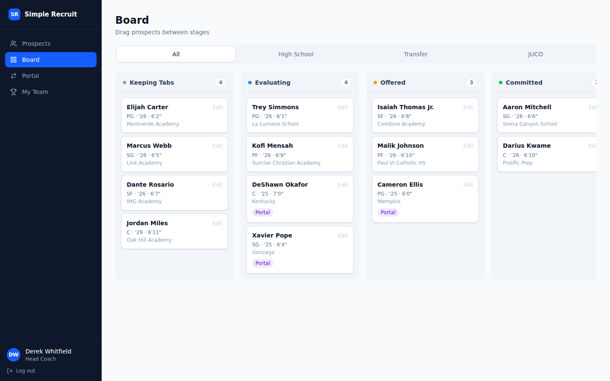
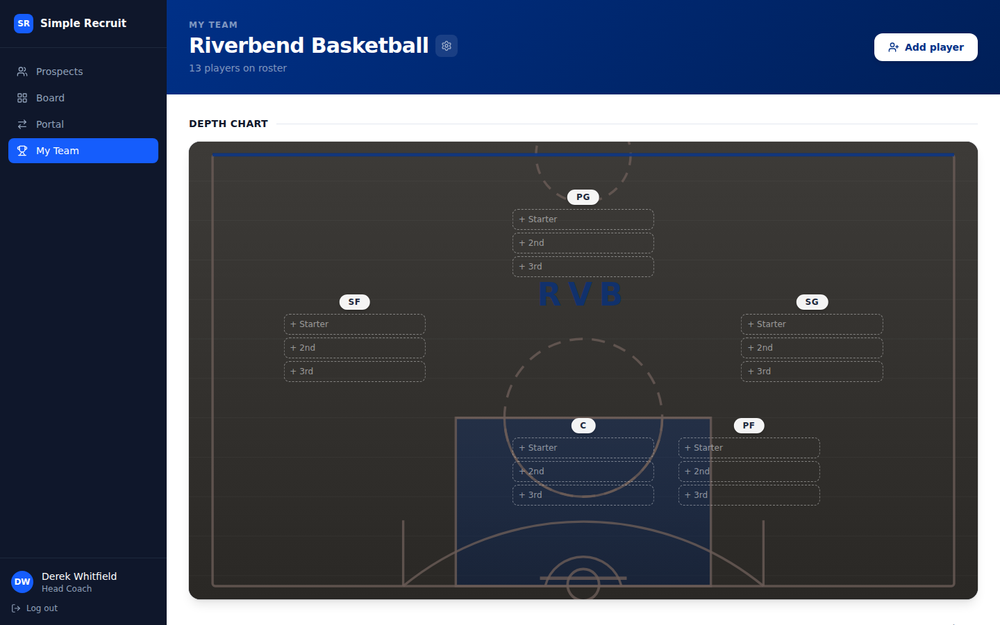

# Simple Recruit

A recruiting pipeline and player-development tracker for basketball coaches. Coaches log prospects, record evaluations, move players through recruiting stages on a Kanban board, and maintain a shared team roster — all with role-based access control and a full audit trail.

Built as a full-stack application: **React (Vite)** frontend, **Node/Express** API, **PostgreSQL** database, **JWT** auth with role-based access control.

## Live Demo

**[simple-recruit-j1w2.vercel.app](https://simple-recruit-j1w2.vercel.app)**

> First load can take ~20-30 seconds — the free-tier API spins down when idle and needs a moment to wake up. It's fast after that.

Log in with the Riverbend Basketball demo accounts to explore the app:

| Role | Email | Password |
|---|---|---|
| Head Coach | dwhitfield@riverbendu.edu | RiverbendHoops1! |
| Assistant Coach | mreeves@riverbendu.edu | RiverbendHoops2! |

The demo includes a full Riverbend roster, 13 recruits across all pipeline stages (Keeping Tabs → Evaluating → Offered → Committed), and coach evaluations on several prospects. Both accounts share the same team board — changes made by one coach are immediately visible to the other. (Riverbend Basketball and its roster are fictional, invented for this demo.)

## Screenshots


*Recruiting board: prospects move through Keeping Tabs → Evaluating → Offered → Committed.*


*My Team: shared roster across the coaching staff, with depth chart ordering.*

## What it does

**Recruiting board** — Kanban pipeline with four stages: Keeping Tabs, Evaluating, Offered, Committed. Drag cards or use the edit modal to move prospects.

**Prospect profiles** — Name, position, height, weight, school, grad year, contact info, prospect type (HS / Transfer / JUCO). Committed prospects auto-populate to the team roster at their primary position.

**Evaluations** — Any coach can write evaluations on a prospect. Each eval shows the author's name and rating (1–10).

**My Team** — Shared roster across all coaches on the same staff. Depth chart ordering, jersey numbers, year, and height tracked per player.

**Role-based access** — `admin` > `head_coach` > `assistant` > `viewer`. Admins manage users; all authenticated coaches can add prospects and write evaluations.

**Audit log** — Every field change is recorded with who made it and when.

## Stack

| Layer | Tech |
|---|---|
| Frontend | React 18, Vite, React Router, Tailwind CSS |
| Backend | Node, Express, pg |
| Database | PostgreSQL (Neon) |
| Auth | JWT (access + httpOnly refresh cookie), bcrypt |
| Hosting | Vercel (frontend), Render (API) |

## Project layout

```
simple-recruit/
├── client/   # React + Vite frontend
├── server/   # Node + Express API
└── docs/     # architecture notes
```

## Running locally

### Prerequisites
- Node 18+
- PostgreSQL 14+

### 1. Server
```bash
cd server
cp .env.example .env     # fill in DATABASE_URL and JWT secrets
npm install
npm run migrate          # apply all migrations
npm run dev              # starts on http://localhost:4000
```

### 2. Client
```bash
cd client
npm install
npm run dev              # starts on http://localhost:5173
```

### 3. Seed demo data (optional)
```bash
cd server
node src/db/seed.js               # Lewis University staff accounts
node src/db/seed_demo_team.js       # Riverbend coaches + roster
node src/db/seed_demo_team_link.js  # link Riverbend coaches to shared team
node src/db/seed_demo_prospects.js  # Riverbend recruiting board + evaluations
```

### 4. Run the tests
```bash
cd server && npm test   # unit + Supertest integration tests, needs DATABASE_URL set
cd client && npm test   # component tests (Vitest)
```
CI runs both suites (with a disposable Postgres service) on every push — see [`.github/workflows/ci.yml`](.github/workflows/ci.yml).

## Why this exists

Recruiting boards live in spreadsheets and group texts. This app centralizes prospect evaluation with things spreadsheets don't give you: role-based access (who can see and change what), a shared view across a coaching staff, a visual pipeline, and an audit trail so changes are transparent and reversible.

## Architecture

See [`docs/architecture.md`](docs/architecture.md) for the data model and key design decisions (UUID keys, soft deletes, service-layer audit logging, team scoping).
